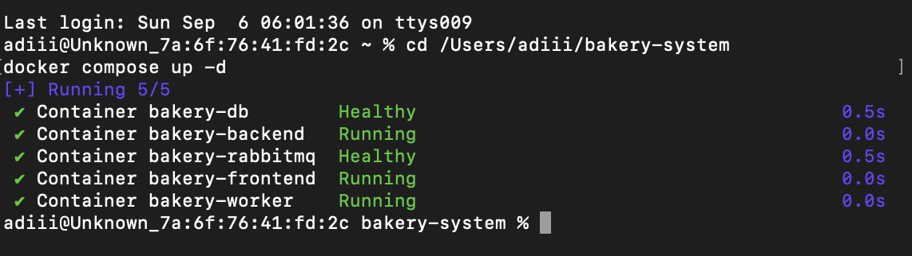

# 🍰 Sweet Bakery — Bakery Management System

A full-stack bakery management system for managing products, inventory, customers, and orders through a modern and easy-to-use dashboard.

The project is containerized using **Docker and Docker Compose** and includes PostgreSQL, FastAPI, React/Nginx, RabbitMQ, and a background worker service.

## 🚀 Live Demo

**Live Application:**
https://effervescent-kleicha-e9bd9b.netlify.app/

**Backend API:**
https://bakery-management-system-p36q.onrender.com/

**GitHub Repository:**
https://github.com/adityakumarjha12/bakery-management-system

---

## ✨ Features

### 📊 Dashboard

* Total products
* Total inventory items
* Low-stock products
* Total orders
* Total sales

### 🍰 Product Management

* Add products
* Edit products
* Delete products
* Search products
* Filter products by category
* Track product prices and stock

### 📦 Inventory Management

* Real-time stock tracking
* Minimum stock levels
* Automatic low-stock detection
* Prevents stock from going below zero

### 👥 Customer Management

* Add customers
* Store customer name, email and phone
* Associate customers with orders

### 🛒 Order Management

* Create orders
* Select customers and products
* Set order quantities
* Calculate order totals
* Automatically update inventory
* Track order status
* Check order status through API
* Calculate total sales

### 🐇 RabbitMQ Order Processing

* Orders are published to a RabbitMQ queue after creation
* A dedicated worker service consumes orders from the queue
* Worker processes orders asynchronously
* RabbitMQ provides reliable message delivery between the backend and worker

### ❤️ Container Health Monitoring

Health checks are configured for all five Docker services:

* PostgreSQL
* FastAPI Backend
* RabbitMQ
* Worker
* React/Nginx Frontend

---
## ✅ Advanced Features Implemented

As part of the assignment's advanced requirements, two features were implemented:

1. **Worker Service** — A dedicated container consumes order messages from RabbitMQ and processes them asynchronously, decoupled from the API server.
2. **Health Checks** — All five containers (PostgreSQL, backend, RabbitMQ, worker, frontend) have configured health checks so Docker Compose can verify functional readiness, not just process uptime.

---

## 📸 Screenshots

### Dashboard


### Products


### Orders


### Docker Containers Health Check

All five services are running successfully with Docker Compose.



---

## 🛠️ Tech Stack

### Frontend

* React.js
* Vite
* JavaScript
* HTML5
* CSS3
* Nginx

### Backend

* Python
* FastAPI
* Uvicorn
* SQLAlchemy
* Pika

### Database

* PostgreSQL
* Psycopg2

### Message Queue

* RabbitMQ
* RabbitMQ Management Plugin

### Containerization

* Docker
* Docker Compose

### Deployment

* Netlify — Frontend
* Render — Backend
* Render PostgreSQL — Database

### Development

* Git
* GitHub
* VS Code

---

## 🏗️ Architecture

### Production Architecture

```text
                    Sweet Bakery
                         │
                         ▼
              ┌─────────────────────┐
              │      Frontend       │
              │    React + Vite     │
              │      Netlify        │
              └──────────┬──────────┘
                         │
                    REST API
                         │
                         ▼
              ┌─────────────────────┐
              │       Backend       │
              │       FastAPI       │
              │       Render        │
              └──────────┬──────────┘
                         │
                         ▼
              ┌─────────────────────┐
              │     PostgreSQL      │
              │       Database      │
              │       Render        │
              └─────────────────────┘
```

### Docker Architecture

```text
                         Sweet Bakery
                              │
                              ▼
                 ┌─────────────────────┐
                 │ Frontend Container   │
                 │ React + Nginx        │
                 │ Port 5173 → 80       │
                 └──────────┬──────────┘
                            │
                            ▼
                 ┌─────────────────────┐
                 │ Backend Container    │
                 │ FastAPI + Uvicorn    │
                 │ Port 8000            │
                 └──────┬─────────┬────┘
                        │         │
                        ▼         ▼
              ┌─────────────┐  ┌─────────────┐
              │ PostgreSQL  │  │  RabbitMQ   │
              │ Container   │  │  Container  │
              │             │  │             │
              └─────────────┘  └──────┬──────┘
                                       │
                                       ▼
                              ┌────────────────┐
                              │ Worker         │
                              │ Container      │
                              │ Python + Pika  │
                              └────────────────┘
```

All Docker services communicate through a dedicated Docker bridge network.

---

## 📁 Project Structure

```text
bakery-management-system/

│
├── backend/
│   ├── main.py
│   ├── models.py
│   ├── database.py
│   ├── worker.py
│   ├── requirements.txt
│   ├── Dockerfile
│   └── .dockerignore
│
├── frontend/
│   ├── src/
│   │   ├── App.jsx
│   │   ├── App.css
│   │   ├── index.css
│   │   └── main.jsx
│   ├── public/
│   ├── package.json
│   ├── vite.config.js
│   ├── Dockerfile
│   └── .dockerignore
│
├── screenshots/
│   ├── dashboard.png
│   ├── products.png
│   ├── orders.png
│   └── docker-health.png
│
├── .gitignore
├── docker-compose.yml
├── README.md
└── netlify.toml
```

---

# 🐳 Docker Setup

## Prerequisites

Install:

* Docker Desktop
* Git

Verify Docker:

```bash
docker --version
docker compose version
```

## Clone the Repository

```bash
git clone https://github.com/adityakumarjha12/bakery-management-system.git
cd bakery-management-system
```

## Start All Services

```bash
docker compose up -d --build
```

This starts:

| Service    | Purpose                    |     Port |
| ---------- | -------------------------- | -------: |
| `db`       | PostgreSQL database        |     5432 |
| `backend`  | FastAPI API                |     8000 |
| `rabbitmq` | Message queue              |     5672 |
| `worker`   | Background order processor | Internal |
| `frontend` | React + Nginx              |     5173 |

## Check Container Status

```bash
docker compose ps
```

All five services should become healthy/running.

Expected services:

```text
bakery-db
bakery-backend
bakery-rabbitmq
bakery-worker
bakery-frontend
```

## Access the Application

Frontend:

```text
http://localhost:5173
```

Backend:

```text
http://localhost:8000
```

Swagger API documentation:

```text
http://localhost:8000/docs
```

RabbitMQ Management Dashboard:

```text
http://localhost:15672
```

## Stop the Application

```bash
docker compose down
```

The PostgreSQL data is stored in a Docker named volume, so database data persists when containers are stopped.

To remove containers and the database volume:

```bash
docker compose down -v
```

---

# 🔌 API Documentation

## Products

### List all products

```http
GET /products
```

Returns all bakery products.

### Create a product

```http
POST /products
```

Example:

```json
{
  "name": "Chocolate Cake",
  "price": 500,
  "stock": 10,
  "description": "Fresh chocolate cake",
  "category": "Cake"
}
```
### Update a product

```http
PUT /products/{product_id}

{
  "name": "Chocolate Cake",
  "price": 550,
  "stock": 8,
  "description": "Fresh chocolate cake",
  "category": "Cake"
}

DELETE /products/{product_id}

GET /customers

POST /customers

{
  "name": "Test Customer",
  "email": "test@example.com",
  "phone": "9876543210"
}

---

## Orders

### Place an order

```http
POST /orders
```

Example:

```json
{
  "customer_id": 1,
  "product_id": 1,
  "quantity": 1
}
```

The backend:

1. Validates the customer and product.
2. Creates the order.
3. Calculates the total price.
4. Updates inventory.
5. Publishes the order to RabbitMQ.

### Check order status

```http
GET /orders/{order_id}/status
```

Example:

```text
GET /orders/4/status
```

Response:

```json
{
  "order_id": 4,
  "status": "Pending"
}
```

### Update order status

```http
PUT /orders/{order_id}/status
```

Supported statuses:

```text
Pending
Preparing
Ready
Completed
```

---

# 🐇 RabbitMQ and Worker Processing

When an order is created, the backend publishes order information to the RabbitMQ `orders` queue.

```text
Customer
   │
   ▼
POST /orders
   │
   ▼
FastAPI Backend
   │
   ├──────────────► PostgreSQL
   │
   └──────────────► RabbitMQ
                         │
                         ▼
                    orders queue
                         │
                         ▼
                       Worker
                         │
                         ▼
                 Order Processing
```

The worker uses **Pika** to consume messages from RabbitMQ.

Worker logs can be viewed using:

```bash
docker logs bakery-worker
```

Example:

```text
Connected to RabbitMQ
Order worker is waiting for messages...
Processing order #4 for customer Test Customer
Product ID: 1, Quantity: 1, Total: ₹500.0
Order #4 processed successfully
```

---

# ❤️ Health Checks

Health checks are configured for every container.

### PostgreSQL

Uses `pg_isready` to verify database availability.

### Backend

Calls:

```text
GET /health
```

### RabbitMQ

Uses:

```text
rabbitmq-diagnostics ping
```

### Worker

Tests its ability to connect to RabbitMQ.

### Frontend

Uses `wget` to verify that the Nginx server responds on port 80.

Check health status:

```bash
docker compose ps
```

---

# 🔐 Environment Variables

The production database connection uses the `DATABASE_URL` environment variable.

For Docker Compose, the backend connects to PostgreSQL using the internal Docker service name:

```text
postgresql://bakery_user:bakery_password@db:5432/bakery
```

Production credentials are not stored in the GitHub repository.

---

# 🧪 Testing

The Dockerized application has been tested for:

* ✅ Product creation
* ✅ Product retrieval
* ✅ Customer creation
* ✅ Order creation
* ✅ Order status checking
* ✅ Order status updates
* ✅ Inventory tracking
* ✅ Low-stock detection
* ✅ Stock protection
* ✅ Sales calculation
* ✅ PostgreSQL persistence
* ✅ Frontend-backend communication
* ✅ RabbitMQ message publishing
* ✅ Worker order processing
* ✅ PostgreSQL health check
* ✅ Backend health check
* ✅ RabbitMQ health check
* ✅ Worker health check
* ✅ Frontend/Nginx health check

---

# 📝 Design Decisions

### 1. PostgreSQL Container

PostgreSQL was selected as the relational database because the application contains structured relationships between products, customers, inventory, and orders.

A Docker named volume is used to persist database data.

### 2. FastAPI Backend

FastAPI provides lightweight REST APIs and integrates well with SQLAlchemy and Python-based background services.

### 3. React + Nginx

React is used for the frontend interface. The production build is generated during the Docker image build and served using Nginx.

This reduces runtime dependencies and provides a lightweight production-style frontend container.

### 4. RabbitMQ

RabbitMQ was selected to decouple order creation from asynchronous order processing.

The backend publishes order messages to a durable queue, while the worker processes those messages independently.

### 5. Worker Service

A separate worker container allows order processing to happen independently from the API server.

This architecture can be scaled by running additional worker instances when required.

### 6. Health Checks

Health checks allow Docker Compose to determine whether individual services are functioning correctly rather than only checking whether the containers are running.

### 7. Docker Compose

Docker Compose was used to manage the complete multi-container application from a single configuration file.

This simplifies development, testing, networking, and deployment of the containerized system.

---

# 🔮 Future Improvements

* User authentication
* Role-based access control
* Product image uploads
* Sales analytics
* Invoice generation
* Order cancellation
* Inventory restocking
* PDF/Excel reports
* Email notifications
* Redis caching
* Automated CI/CD pipeline
* Production Kubernetes deployment

---

## 👨‍💻 Author

**Aditya Kumar Jha**

B.Tech — Computer Science & Engineering
Specialization: Cloud Computing & Virtualization

GitHub:
https://github.com/adityakumarjha12

---

⭐ If you find this project useful, consider giving the repository a star!
