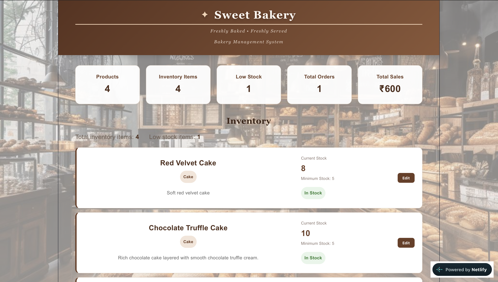
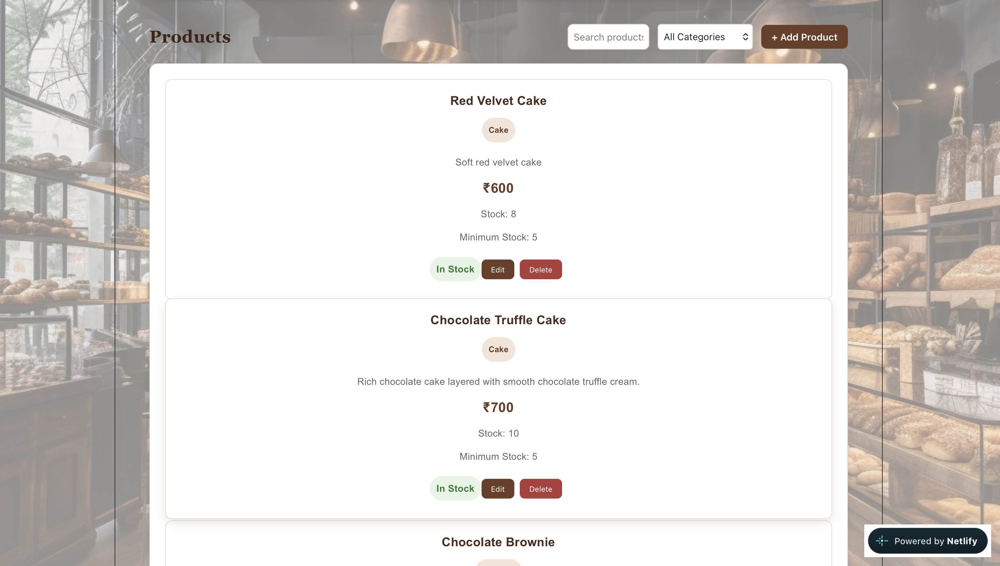
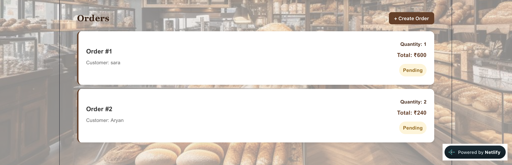

# 🍰 Sweet Bakery — Bakery Management System

A full-stack bakery management system for managing products, inventory, customers, and orders through a modern and easy-to-use dashboard.

## 🚀 Live Demo

**Live Application:**
https://effervescent-kleicha-e9bd9b.netlify.app/

**Backend API:**
https://bakery-management-system-p36q.onrender.com/

## ✨ Features

### 📊 Dashboard

* Total products
* Total inventory items
* Low-stock products
* Total orders
* Total sales

### 🍰 Product Management

* Add products
* Edit products
* Delete products
* Search products
* Filter products by category
* Track product prices and stock

### 📦 Inventory Management

* Real-time stock tracking
* Minimum stock levels
* Automatic low-stock detection
* Prevents stock from going below zero

### 👥 Customer Management

* Add customers
* Store customer name, email and phone
* Associate customers with orders

### 🛒 Order Management

* Create orders
* Select customers and products
* Set order quantities
* Calculate order totals
* Automatically update inventory
* Track order status
* Calculate total sales

## 📸 Screenshots

### Dashboard



### Products



### Orders



## 🛠️ Tech Stack

### Frontend

* React.js
* Vite
* JavaScript
* HTML5
* CSS3

### Backend

* Python
* FastAPI
* Uvicorn
* SQLAlchemy

### Database

* PostgreSQL
* Psycopg2

### Deployment

* Netlify — Frontend
* Render — Backend
* Render PostgreSQL — Database

### Development

* Git
* GitHub
* VS Code

## 🏗️ Architecture

```text
User
  │
  ▼
React + Vite
(Netlify)
  │
  │ REST API
  ▼
FastAPI
(Render)
  │
  │ SQLAlchemy
  ▼
PostgreSQL
(Render)
```

## 📁 Project Structure

```text
bakery-management-system/
│
├── backend/
│   ├── main.py
│   ├── models.py
│   ├── database.py
│   └── requirements.txt
│
├── frontend/
│   ├── src/
│   │   ├── App.jsx
│   │   ├── App.css
│   │   ├── index.css
│   │   └── main.jsx
│   ├── public/
│   ├── package.json
│   └── vite.config.js
│
├── screenshots/
│   ├── dashboard.png
│   ├── products.png
│   └── orders.png
│
├── .gitignore
├── README.md
└── netlify.toml
```

## ⚙️ Run Locally

### Clone the repository

```bash
git clone https://github.com/adityakumarjha12/bakery-management-system.git
cd bakery-management-system
```

### Start Backend

```bash
cd backend
pip install -r requirements.txt
uvicorn main:app --reload
```

Backend:

```text
http://127.0.0.1:8000
```

### Start Frontend

Open another terminal:

```bash
cd frontend
npm install
npm run dev
```

Frontend:

```text
http://localhost:5173
```

## 🔐 Environment Variables

The production database connection is stored securely using the `DATABASE_URL` environment variable.

No database passwords or credentials are stored in the GitHub repository.

## 🧪 Production Testing

The live application has been tested for:

* ✅ Product creation
* ✅ Product retrieval
* ✅ Customer creation
* ✅ Order creation
* ✅ Inventory tracking
* ✅ Low-stock detection
* ✅ Stock protection
* ✅ Sales calculation
* ✅ PostgreSQL persistence
* ✅ Frontend-backend communication
* ✅ Production CORS configuration

## 🔮 Future Improvements

* User authentication
* Role-based access control
* Product image uploads
* Sales analytics
* Invoice generation
* Order cancellation
* Inventory restocking
* PDF/Excel reports
* Email notifications

## 👨‍💻 Author

**Aditya Kumar Jha**

B.Tech — Computer Science & Engineering
Specialization: Cloud Computing & Virtualization

GitHub:
https://github.com/adityakumarjha12

---

⭐ If you find this project useful, consider giving the repository a star!
